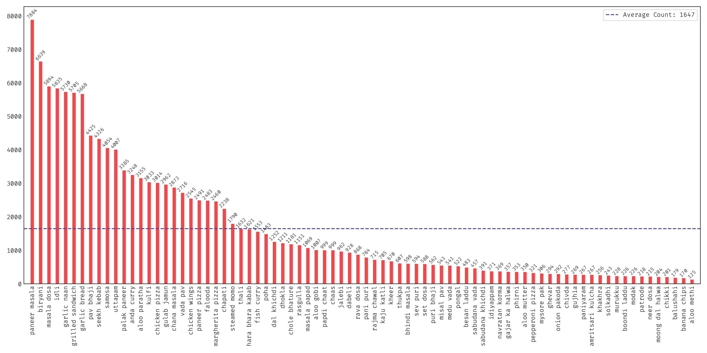

# <p align="center"> Khana: A Comprehensive Indian Cuisine Dataset </p>

## Dataset


## Description
Khana is a food classification dataset featuring the wide range of dishes from Indian cuisine. The goal of this dataset is to solve challenges found in existing datasets: lack of representation of Indian food dishes, generalization over limited diversity due to Western-influenced classes, conditions, viewpoints and environments. The dataset contains **131,000+** images comprising of **80** food dishes. You can download the labels from the dataset here and the taxonomy created during its inception here. Khana does not own the copyright of the images. It only compiles an accurate list of web images for each food dish. It is available for researchers and educators who wish to use the images for non-commercial research and/or educational purposes only.

## Detailed Statistics
The figure showns the detailed statistics of Khana with distributions of categories and images per food category.


## Download Dataset
Google Drive Link: https://drive.google.com/drive/folders/1PWyJdkizw5ABBd8BIAnr_FZq91YZ2Uo0?usp=sharing

## Cite
```
@misc{prabhu2025,
      title={Khana: A Comprehensive Indian Cuisine Dataset}, 
      author={Omkar Prabhu},
      year={2025},
      eprint={2509.06006},
      archivePrefix={arXiv},
      primaryClass={cs.CV},
      url={https://arxiv.org/abs/2509.06006}, 
}
```
